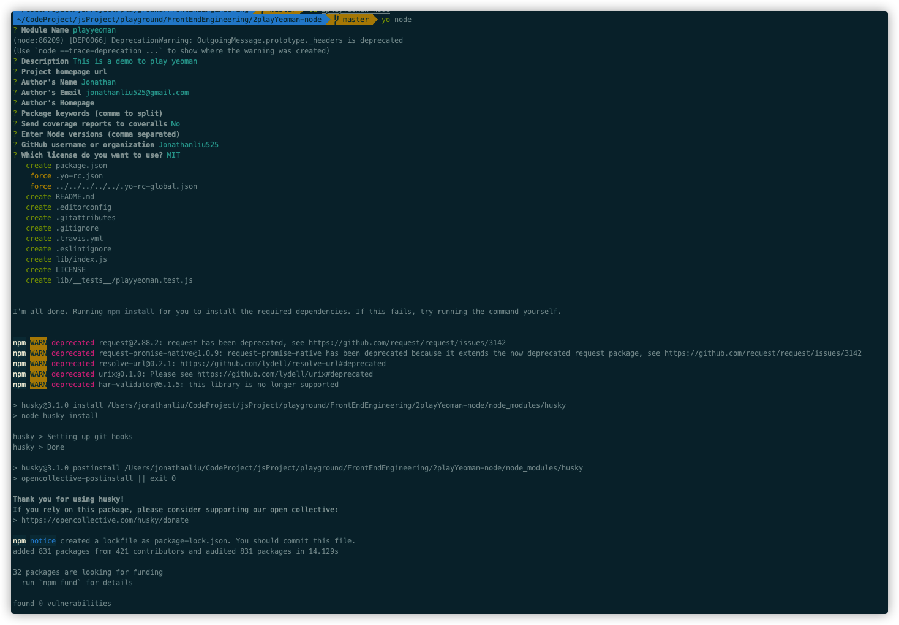

Global install yeoman

```bash
npm install -g yo
```

Install generator to work with yeoman

```bash
npm install -g generator-node
```

Then start playing

```bash
mkdir 2playYeoman-node
yo node
```



## Sub Generator

```
yo node:cli
```

## Customised Generator

> https://yeoman.io/authoring/

see the folder `1Yeoman/generator-jonSample`

## Use template to cerate file

> https://yeoman.io/authoring/file-system.html

## User interaction

> https://yeoman.io/authoring/user-interactions.html
